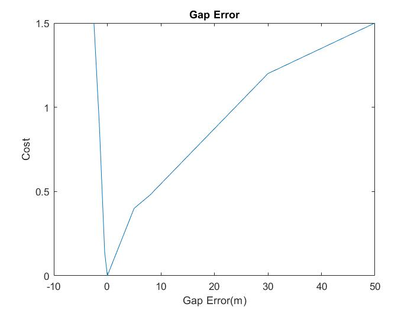
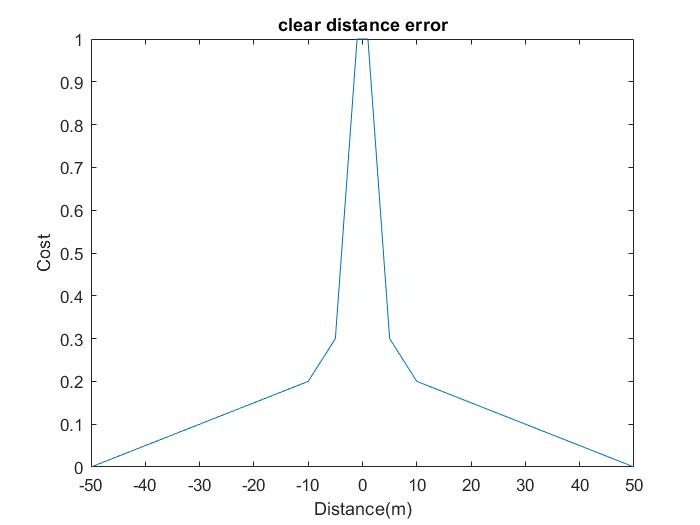
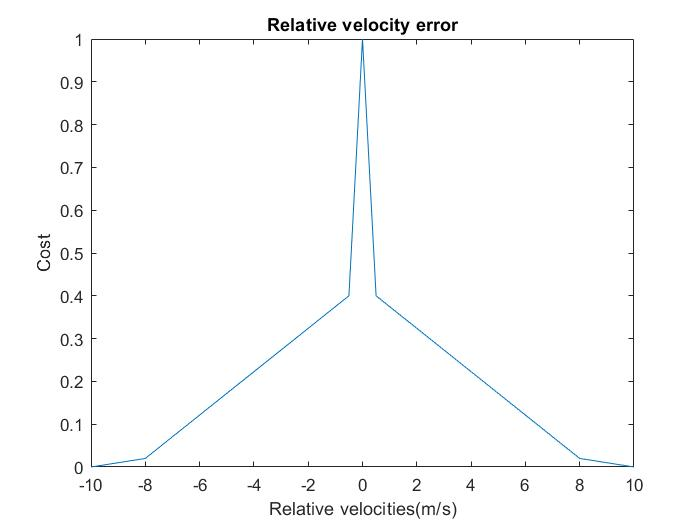
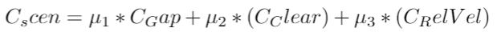
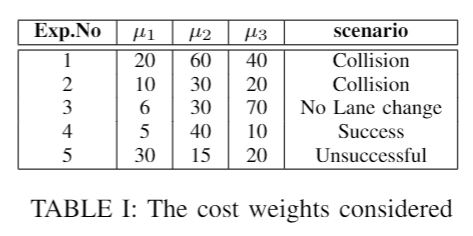

# Behaviour-Planning-for-Autonomous-Vehicles
The research consists of 3 Models we worked. Model-1, Model-2, Model-3. This repo consists of Model-2 which need to be updated with Lane change planner. 

The cost libraries are for relative velocities, Gap error and  Clear distance. 

The costs are calculated as follows:

Th weights of the costs for experimentation are taken as follows:

Currently we are working adding different cost libraries and tunning to get better results. 
The extension of this project is to export the MATLAB files into C++ and test them in CARLA Simulator. 
So stay tuned!

# References:

* J.Wei and J.M.Dolan, “A robust autonomous freeway driving algo-rithm,” in 2009 IEEE Intelligent Vehicles Symposium. IEEE, 2009, pp.1015–1020.
* J. Wei, J. M. Dolan, and B. Litkouhi, “A prediction-and cost function-based algorithm for robust autonomous freeway driving,” in2010 IEEEIntelligent Vehicles Symposium. IEEE, 2010, pp. 512–517.
* M.Seo-WookPark, [Design and Test Decision-Making, Path-Planning, and Control Modules in Traffic Scenarios](https://www.mathworks.com/videos/design-and-test-decision-making-path-planning-and-control-modules-in-traffic-scenarios-1558962225433.html)
